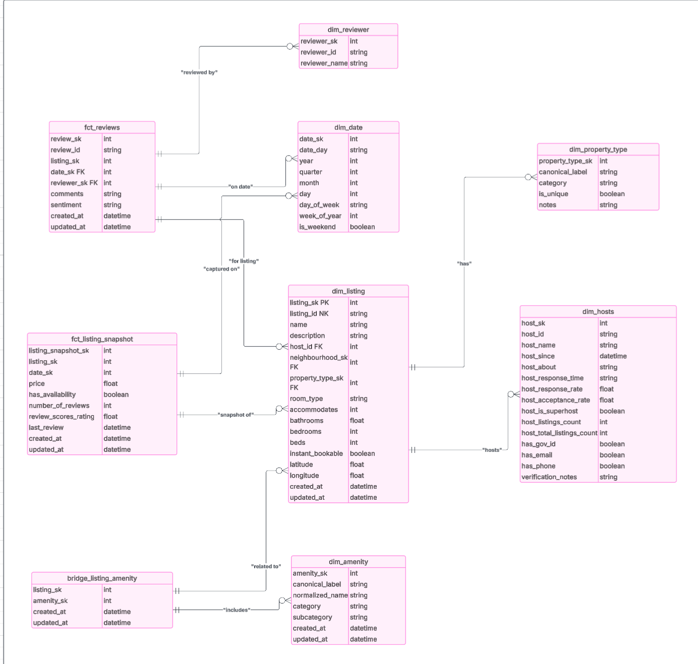

# dbt-airbnb-analytics

End-to-end Airbnb analytics project using **dbt** for data transformation and a dashboard to visualize key metrics.  

## 📌 Project Status
- ✅ Data exploration started  
- 🔄 Designing data model (staging + star schema)  
- ⏳ Building transformations in dbt  
- ⏳ Defining business metrics  
- ⏳ Creating dashboard for Airbnb analytics
  
📌 *I will keep updating this README as the project moves forward.* 
---

## 📑 Table of Contents
1. [Public Dashboard](#-public-dashboard)  
2. [Architecture](#-architecture)  
3. [Data Model](#-data-model)  
4. [ETL Flow](#-etl-flow)  
5. [Major Metrics](#-major-metrics)  
6. [Data Quality Checks](#-data-quality-checks)  
7. [Dashboard](#-dashboard)  
8. [Next Steps](#-next-steps)  

---

## 📊 Public Dashboard
🔗 [View the dashboard here](<ADD_LINK>)  

👉 *[Insert a screenshot of the dashboard]*  
  

---

## 🏗️ Architecture
This project follows a modern data stack pipeline:  

 
Data is sourced from publicly available Airbnb CSV files containing listings and reviews. These files are ingested into a Snowflake data warehouse where dbt-fusion orchestrates transformations to clean the raw data, build staging layers, and create fact and dimension tables in marts. The transformed data is then used to power an interactive dashboard built in Power BI, providing insights into key metrics such as pricing, occupancy, host performance, and guest reviews.

---

## 📐 Data Model
The project uses a **star schema** design:  
## 📄 Tables

### Dimensions
- dim_listing  
- dim_host  
- dim_neighbourhood  
- dim_property_type  
- dim_date  
- dim_amenity  
- dim_reviewer  

### Facts
- fct_reviews  
- fct_listing_snapshot  

### Bridges
- bridge_listing_amenity 

  
 

---

## 🔄 ETL Flow
The transformation pipeline includes:  
1. **Raw Layer** → Load Airbnb CSVs into Snowflake  
2. **Staging Layer** → Clean and standardize source tables (`stg_listings`, `stg_reviews`)  
3. **Intermediate Layer** → Join and enrich datasets (host details, review scores)  
4. **Marts Layer** → Facts and dimensions ready for analytics  

👉 *[Insert your ETL flow diagram]*  
  

---

## 📊 Major Metrics
Some of the business metrics tracked in this project:  
- Active Listings  
- Superhost %  
- Median Price per Night  
- Occupancy Rate (L365d)  
- Average Review Score  
- Reviews per Listing  
- Instant Bookable %  

👉 *[Add a chart or metric cards screenshot]*  
  

---

## ✅ Data Quality Checks
Implemented using dbt tests + dbt-utils:  
- **Uniqueness**: `id`, `host_id` in dimension tables  
- **Not Null**: keys and required fields (price, room_type, review scores)  
- **Accepted Values**: room types, property types, host verification methods  
- **Custom Tests**: `price >= 0`, occupancy rate within valid range  

👉 *[Add a dbt test results screenshot]*  
  

---

## 📊 Dashboard
The dashboard provides:  
- Listing distribution by room type, price, and neighborhood  
- Host performance (Superhost %, acceptance rate, response time)  
- Occupancy and revenue trends  
- Review score breakdowns  

👉 *[Insert final dashboard screenshots]*  
  
  

---

## 🚀 Next Steps
- Automate with CI/CD (GitHub Actions)  
- Add incremental models for performance  
- Expand metrics with time-based trends  

---
