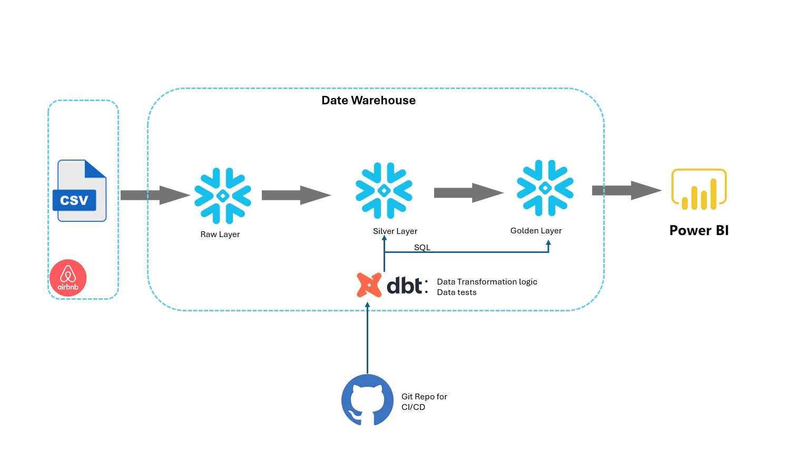

# dbt-airbnb-analytics


End-to-end Airbnb analytics project using **dbt** for data transformation and a dashboard to visualize key metrics.  

---

## 📑 Table of Contents

1. [Public Dashboard](#public-dashboard)
2. [Architecture](#architecture)
3. [Data Model](#data-model)
4. [ETL Flow](#etl-flow)
5. [Snapshot Strategy](#snapshot-strategy)
6. [Major Metrics](#major-metrics)
7. [Data Quality Checks](#data-quality-checks) 

---

## Public Dashboard

🔗 [View the dashboard here](ADD_LINK)

👉 *[Insert a screenshot of the dashboard]*

---

## Architecture





Data is sourced from publicly available Airbnb CSV files containing listings, reviews, and neighbourhood data. The raw data is loaded into Snowflake, where dbt Fusion is used to transform, clean, and standardize the data through staging models and build analytics-ready fact and dimension tables in the mart layer. The transformed data is then used to create an interactive Power BI dashboard, providing insights into key metrics such as pricing, availability, host performance, and guest reviews.

---

## Data Model
The project uses a **dimensional data model with a snowflake-style structure**. Related entities such as hosts, neighbourhoods, and property types are modeled as separate dimensions because they can be shared across multiple listings. This reduces data duplication and represents the natural relationships between Airbnb entities more clearly.

## 📄 Tables

### Dimensions
- dim_listing  
- dim_host  
- dim_neighbourhood  
- dim_date  
- dim_amenity  
- dim_reviewer  

### Facts
- fct_reviews  


### Bridges
- bridge_listing_amenity 


 
### Bus Matrix
The bus matrix summarizes the relationship between business processes and shared dimensions.

📋 [View the Bus Matrix](docs/airbnb-bus-matrix.md)

---

## 🔄 ETL Flow

The project follows a layered transformation workflow from raw Airbnb source files to analytics-ready models:

1. **Raw Layer** → Public Airbnb CSV files are loaded into Snowflake and stored in the `airbnb_raw` database under the `property` and `review` schemas.

2. **Staging Layer** → dbt staging models clean and standardize the raw source data. Key transformations include:

   * Handling null and missing values
   * Trimming and standardizing text fields
   * Standardizing boolean values
   * Converting fields to appropriate data types
   * Cleaning price and percentage fields
   * Preparing source fields for downstream dimensional modeling

3. **Snapshot** → dbt snapshots track historical changes in **listing and host data** using SCD Type 2 logic, preserving previous versions of listing and host attributes as they change over time.

4. **Mart Layer** → Staged and snapshot data is transformed into analytics-ready fact, dimension, and bridge tables. Key transformations and modeling steps include:

   * Creating dedicated dimensions for listings, hosts, neighbourhoods, property types, reviewers, and amenities
   * Parsing and flattening semi-structured amenity data to create `dim_amenity`
   * Creating `bridge_listing_amenity` to handle the many-to-many relationship between listings and amenities
   * Parsing the semi-structured `host_verifications` field into separate indicators for government ID, email, and phone verification
   * Creating fact tables for reviews and listing-related analytical data
   * Applying surrogate keys to establish relationships between facts and dimensions

5. **Analytics Layer** → The mart models provide the foundation for the Power BI semantic model and interactive dashboard.

### 📋 Source-to-Target Mapping (STTM)

Detailed field-level mappings, data types, and transformation rules from source data to the final analytical models are documented in the [Source-to-Target Mapping (STTM)](docs/source-to-target-mapping.xlsx).

### 🔗 dbt Model Lineage

The dbt lineage graph below shows the dependencies and transformation flow from source data through staging models to analytics-ready marts.


### 📋 Source-to-Target Mapping (STTM)

Detailed field-level mappings, data types, and transformation rules from source data to the final analytical models are documented in the [Source-to-Target Mapping (STTM)](docs/source-to-target-mapping.xlsx).
  

---
## Snapshot Strategy

Two dimensions, `dim_host` and `dim_listing`, are modeled as **Slowly Changing Dimensions (SCD Type 2)** to preserve the history of selected attributes that may change over time.

Both dimensions originate from the same `listings` source table, which contains a combination of listing-level and host-level attributes. To track these entities independently and at the correct grain, two separate staging models are created:

- `stg_listings__listing_subset` — one row per `listing_id`, containing the listing attributes selected for historical tracking.
- `stg_listings__host_subset` — one row per `host_id`, containing the host attributes selected for historical tracking.

Each staging model feeds its corresponding dbt snapshot. This prevents listing-level changes from creating unnecessary host history (and vice versa) and allows each snapshot to use the appropriate business key.

Both snapshots use dbt's **timestamp strategy**, with `last_scraped` as the `updated_at` column.

#### Snapshot Lineage

```text
                         source: listings
                                │
                ┌───────────────┴───────────────┐
                │                               │
 stg_listings__listing_subset       stg_listings__host_subset
       Grain: listing_id                  Grain: host_id
                │                               │
                ▼                               ▼
     scd_listings__listings            scd_listings__hosts
           SCD Type 2                       SCD Type 2
                │                               │
                ▼                               ▼
           dim_listing                       dim_host
```

---
## 📊 Major Metrics

Key business metrics tracked in this project:

### 🏠 Listings & Supply
- **Active Listings** → count of distinct `listing_id` where `has_availability = true`  
- **Superhost %** → (count of listings with `host_is_superhost = true`) ÷ total listings × 100  
- **Listings by Property Type** → count of listings grouped by `property_type`  

### 💰 Pricing
- **Median Price per Night** → median(`price`) across listings  
- **Average Price by Neighbourhood** → avg(`price`) grouped by `neighbourhood`  

### ⭐ Reviews & Quality
- **Total Reviews** → sum(`number_of_reviews`)  
- **Average Review Score** → avg(`review_scores_rating`)  
- **Recent Reviews Trend** → count of reviews in `fct_reviews` by `date`  
- **% Positive Reviews** → (count of reviews with `sentiment = 'Positive'`) ÷ total reviews × 100  

### 👩‍💼 Host Performance
- **Average Host Response Rate** → avg(`host_response_rate`)  
- **Average Host Acceptance Rate** → avg(`host_acceptance_rate`)  
- **Listings per Host** → avg(`host_listings_count`)  
- **Instant Bookable %** → (count of `instant_bookable = true`) ÷ total listings × 100  

👉 *[Add a chart or metric cards screenshot]*  
  

 
👉 *[Add a chart or metric cards screenshot]*  
  

---

## ✅ Data Quality Checks
Implemented using dbt tests + dbt-utils:  
- **Uniqueness**: `id`, `host_id` in dimension tables  
- **Not Null**: keys and required fields (price, room_type, review scores)  
- **Accepted Values**: room types, property types, host verification methods  
- **Custom Tests**: `price >= 0`, occupancy rate within valid range  

👉 *[Add a dbt test results screenshot]*  
  

---

## 📊 Dashboard
flowchart TD

    A[Dashboard: Airbnb Analytics] --> B[Page 1: Overview]
    A --> C[Page 2: Map & Supply]
    A --> D[Page 3: Pricing]
    A --> E[Page 4: Reviews & Sentiment]
    A --> F[Page 5: Host Performance]

    B --> B1[KPIs: Active Listings, Median Price, Avg Rating, Superhost %, Total Reviews, % Positive Sentiment]
    B --> B2[Filters: Neighbourhood, Property Type, Room Type, Superhost, Availability]
    B --> B3[Charts: Listings by Property Type, Price Trend, Rating by Neighbourhood]

    C --> C1[KPI: Active Listings]
    C --> C2[Map: Listings by Lat/Long, Colored by Rating Band]
    C --> C3[Chart: Listings by Room Type]
    C --> C4[Table: Listing Directory]

    D --> D1[KPIs: Median Price, Avg Price, Price IQR]
    D --> D2[Chart: Price Trend Over Time]
    D --> D3[Chart: Price Distribution by Neighbourhood]
    D --> D4[Chart: Median Price by Property Type]

    E --> E1[KPIs: Total Reviews, Avg Rating, % Positive]
    E --> E2[Line: Review Counts Over Time]
    E --> E3[Stacked Bar: Sentiment by Neighbourhood]
    E --> E4[Table: Recent Reviews with Sentiment]

    F --> F1[KPIs: Avg Response Rate, Avg Acceptance Rate, Superhost %]
    F --> F2[Chart: Listings per Host (Top N)]
    F --> F3[Chart: Superhost % by Neighbourhood]
    F --> F4[Table: Host Directory]

The dashboard provides:  
- Listing distribution by room type, price, and neighborhood  
- Host performance (Superhost %, acceptance rate, response time)  
- Occupancy and revenue trends  
- Review score breakdowns  

👉 *[Insert final dashboard screenshots]*  
  
  

---

