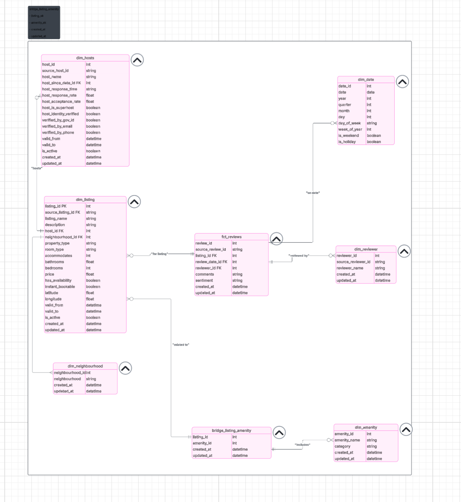

# dbt-airbnb-analytics


End-to-end Airbnb analytics project using **dbt** for data transformation and a dashboard to visualize key metrics.  

---

## 📑 Table of Contents

1. [Public Dashboard](#public-dashboard)
2. [Architecture](#architecture)
3. [Data Model](#data-model)
4. [ETL Flow](#etl-flow)
5. [Snapshot Strategy](#snapshot-strategy)
6. [Major Metrics](#major-metrics)
7. [Data Quality Checks](#data-quality-checks) 

---

## Public Dashboard

🔗 [View the dashboard here](ADD_LINK)

👉 *[Insert a screenshot of the dashboard]*

---

## Architecture


Data is sourced from publicly available Airbnb CSV files containing listings, reviews, and neighbourhood data. The raw data is loaded into Snowflake, where dbt Fusion is used to transform, clean, and standardize the data through staging models and build analytics-ready fact and dimension tables in the mart layer. The transformed data is then used to create an interactive Power BI dashboard, providing insights into key metrics such as pricing, availability, host performance, and guest reviews.

---

## Data Model
The project uses a **dimensional data model with a snowflake-style structure**. Related entities such as hosts, neighbourhoods, and property types are modeled as separate dimensions because they can be shared across multiple listings. This reduces data duplication and represents the natural relationships between Airbnb entities more clearly.

## 📄 Tables

### Dimensions
- dim_listing  
- dim_host  
- dim_neighbourhood  
- dim_date  
- dim_amenity  
- dim_reviewer  

### Facts
- fct_reviews  



### Bridges
- bridge_listing_amenity 

 
### Bus Matrix
The bus matrix summarizes the relationship between business processes and shared dimensions.

📋 [View the Bus Matrix](docs/airbnb-bus-matrix.md)

---

## ETL Flow

The project follows a layered transformation workflow from raw Airbnb source files to analytics-ready models:

1. **Raw Layer** → Public Airbnb CSV files are loaded into Snowflake and stored in the `airbnb_raw` database under the `property` and `review` schemas.

2. **Staging Layer** → dbt staging models clean and standardize the raw source data. Common transformations include handling null values, trimming and standardizing text, converting data types, standardizing boolean values, and cleaning price and percentage fields.

3. **Snapshot Layer** → dbt snapshots track historical changes in **listing and host data** using SCD Type 2 logic. Listings and hosts are tracked independently at their appropriate grain to prevent changes in one entity from creating unnecessary history for the other. See the [Snapshot Strategy](#snapshot-strategy) section for details.

4. **Mart Layer** → Staged and snapshot data is transformed into analytics-ready fact, dimension, and bridge tables. Major transformations and modeling decisions include:

   * **Review Sentiment Classification** → Review comments are classified as **Positive, Negative, or Neutral** using a simple rule-based dbt macro that checks the review text against predefined positive and negative keywords.

   * **Amenities Parsing & Flattening** → The semi-structured amenities field is parsed and flattened so that individual amenities can be modeled and analyzed separately.

   * **Amenities Many-to-Many Relationship** → Because a listing can have many amenities and the same amenity can belong to many listings, amenities are modeled in `dim_amenity` and connected to listings through `bridge_listing_amenity`.

   * **Host Verification Indicators** → The semi-structured `host_verifications` VARCHAR field is parsed into separate indicators for government ID, email, and phone verification, making the verification information easier to analyze.

   * **Dimensional Modeling** → Business entities such as listings, hosts, neighbourhoods, property types, reviewers, and amenities are modeled as dedicated dimensions, with surrogate keys used to establish relationships between facts, dimensions, and bridge tables.

5. **Analytics Layer** → The mart models provide the foundation for the Power BI semantic model and interactive dashboard.


### 📋 Source-to-Target Mapping (STTM)

Detailed field-level mappings, data types, and transformation rules from source data to the final analytical models are documented in the [Source-to-Target Mapping (STTM)](docs/source-to-target-mapping.xlsx).

### 🔗 dbt Model Lineage

The dbt lineage graph below shows the dependencies and transformation flow from source data through staging models to analytics-ready marts.


### 📋 Source-to-Target Mapping (STTM)

Detailed field-level mappings, data types, and transformation rules from source data to the final analytical models are documented in the [Source-to-Target Mapping (STTM)](docs/source-to-target-mapping.xlsx).
  

---
## Snapshot Strategy

Two dimensions, `dim_host` and `dim_listing`, are modeled as **Slowly Changing Dimensions (SCD Type 2)** to preserve the history of selected attributes that may change over time.

Both dimensions originate from the same `listings` source table, which contains a combination of listing-level and host-level attributes. To track these entities independently and at the correct grain, two separate staging models are created:

- `stg_listings__listing_subset` — one row per `listing_id`, containing the listing attributes selected for historical tracking.
- `stg_listings__host_subset` — one row per `host_id`, containing the host attributes selected for historical tracking.

Each staging model feeds its corresponding dbt snapshot. This prevents listing-level changes from creating unnecessary host history (and vice versa) and allows each snapshot to use the appropriate business key.

Both snapshots use dbt's **timestamp strategy**, with `last_scraped` as the `updated_at` column.

#### Snapshot Lineage

```text
                         source: listings
                                │
                ┌───────────────┴───────────────┐
                │                               │
 stg_listings__listing_subset       stg_listings__host_subset
       Grain: listing_id                  Grain: host_id
                │                               │
                ▼                               ▼
     scd_listings__listings            scd_listings__hosts
           SCD Type 2                       SCD Type 2
                │                               │
                ▼                               ▼
           dim_listing                       dim_host
```

---
---

## Data Quality Checks

### Data Quality Tests

As this is a learning and portfolio project, a representative set of dbt tests is implemented to demonstrate different data quality testing approaches rather than providing exhaustive test coverage.

| Layer    | Model                    | Field / Rule             | Test                                               | Severity |
| -------- | ------------------------ | ------------------------ | -------------------------------------------------- | -------- |
| Source   | `source_listings`        | `listing_id`             | Not null and unique                                | Error    |
| Source   | `source_listings`        | `host_id`                | Not null                                           | Error    |
| Source   | `source_listings`        | `host_identity_verified` | Not null                                           | Warning  |
| Source   | `source_listings`        | `room_type`              | Accepted values                                    | Warning  |
| Source   | `source_listings`        | `price`                  | Must be `>= 0`                                     | Error    |
| Mart     | `dim_listing`            | `listing_sk`             | Not null and unique                                | Error    |
| Mart     | `dim_listing`            | `host_sk`                | Relationship to `dim_host`                         | Error    |
| Mart     | `fct_reviews`            | `review_id`              | Not null and unique                                | Error    |
| Mart     | `fct_reviews`            | `sentiment`              | Accepted values: `Positive`, `Neutral`, `Negative` | Error    |
| Mart     | `dim_host`               | Superhost verification   | Flag Superhosts without government ID verification | Warning  |
| Snapshot | `scd_listings__listings` | Current record           | Maximum one current record per `listing_id`        | Error    |


👉 *[Add a dbt test results screenshot]*  
   


---
## 📊 Major Metrics

The dashboard focuses on a concise set of business metrics that support analysis of listings, pricing, reviews, amenities, and host performance.

### 🏠 Listings & Market

* **Active Listings** → Count of distinct listings where `has_availability = true`
* **Median Price per Night** → Median listing price
* **Superhost %** → Percentage of listings associated with Superhosts
* **Average Review Score** → Average overall review rating
* **Listings by Neighbourhood** → Count of listings grouped by neighbourhood
* **Listings by Property Type** → Count of listings grouped by property type
* **Median Price by Neighbourhood** → Median listing price grouped by neighbourhood
* **Top Amenities** → Most common amenities based on the number of associated listings

### ⭐ Reviews & Sentiment

* **Total Reviews** → Count of review records in `fct_reviews`
* **Positive Reviews %** → Percentage of reviews classified as `Positive`
* **Review Sentiment Distribution** → Distribution of Positive, Neutral, and Negative reviews
* **Reviews Over Time** → Number of reviews by review date

### 👩‍💼 Host Performance

* **Average Host Response Rate** → Average host response rate
* **Average Host Acceptance Rate** → Average host acceptance rate
* **Host Verification Coverage** → Percentage of hosts with email, phone, and government ID verification
* **Superhost vs Non-Superhost Review Score** → Comparison of average review scores between Superhosts and non-Superhosts
* **Instant Bookable %** → Percentage of listings that allow instant booking

---

## 📈 Dashboard Design

The Power BI dashboard is intentionally limited to **two pages**, as the primary focus of this project is the analytics engineering workflow, including dbt transformations, dimensional modeling, snapshots, testing, and data lineage.

### Page 1 — Listings & Market Overview

This page provides a high-level view of Airbnb supply and pricing.

**KPI Cards**

* Active Listings
* Median Price per Night
* Superhost %
* Average Review Score

**Visuals**

* Listings by Neighbourhood
* Median Price by Neighbourhood
* Listings by Property Type
* Top 10 Amenities

**Primary Filters**

* Neighbourhood
* Property Type
* Room Type
* Superhost Status

The amenities visual demonstrates how the flattened amenities data and `bridge_listing_amenity` table are used in downstream analytics.

### Page 2 — Reviews & Host Insights

This page focuses on guest feedback and host characteristics.

**KPI Cards**

* Total Reviews
* Positive Reviews %
* Average Host Response Rate
* Average Host Acceptance Rate

**Visuals**

* Reviews Over Time
* Review Sentiment Distribution
* Host Verification Coverage
* Superhost vs Non-Superhost Review Score

**Primary Filters**

* Neighbourhood
* Property Type
* Superhost Status
* Review Date

The sentiment visual uses the rule-based sentiment classification created in dbt, while the host verification visual uses the derived email, phone, and government ID verification indicators.

### Dashboard Preview

👉 *[Insert Page 1 dashboard screenshot]*

👉 *[Insert Page 2 dashboard screenshot]*

👉 *[Insert final dashboard screenshots]*  
  
  

---

